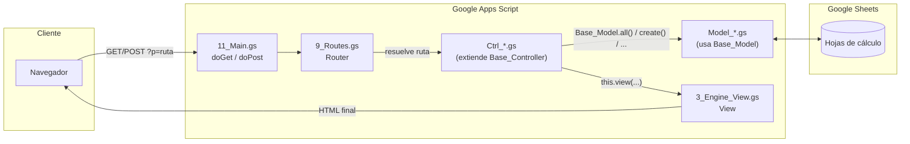
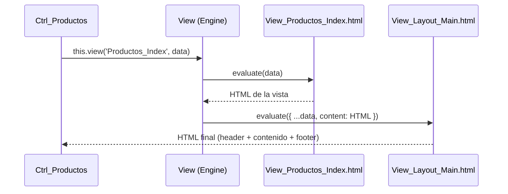

# Framework-MVC-Google-Apps-Script
un esqueleto MVC en POO, con Router, modelos sobre Google Sheets y vistas con Tailwind CSS

Readme · MD
# 🧩 Framework MVC para Google Apps Script
 
> Un micro-framework MVC, orientado a objetos, para construir Web Apps sobre Google Apps Script + Google Sheets como base de datos, con Tailwind CSS para la capa visual.
 


 
---
 
## 📑 Índice
 
1. [Filosofía del proyecto](#-filosofía-del-proyecto)
2. [Paradigma y arquitectura](#-paradigma-y-arquitectura)
3. [Estructura de archivos](#-estructura-de-archivos)
4. [Ciclo de vida de una petición](#-ciclo-de-vida-de-una-petición)
5. [Referencia de clases](#-referencia-de-clases)
   - [CONFIG](#0_configgs--config)
   - [Base_Controller](#1_base_controllergs--base_controller)
   - [Base_Model](#2_base_modelgs--base_model)
   - [View (Engine_View)](#3_engine_viewgs--view)
   - [Router / Route](#9_routesgs--router--route)
   - [Helpers](#10_helpersgs--helpers)
   - [Main (doGet / doPost)](#11_maings--punto-de-entrada)
6. [Sistema de vistas y layouts](#-sistema-de-vistas-y-layouts)
7. [Tailwind CSS e interfaz](#-tailwind-css-e-interfaz)
8. [Guía práctica: crear un módulo CRUD completo](#-guía-práctica-crear-un-módulo-crud-completo)
9. [Manejo de errores (404 / 500)](#-manejo-de-errores-404--500)
10. [Instalación e integración](#-instalación-e-integración)
11. [Convenciones y buenas prácticas](#-convenciones-y-buenas-prácticas)
12. [Roadmap sugerido](#-roadmap-sugerido)
---
 
## 🎯 Filosofía del proyecto
 
Google Apps Script no impone ninguna estructura: por defecto, todo tiende a
terminar en un único archivo lleno de funciones sueltas, HTML mezclado con
lógica de negocio y `SpreadsheetApp` invocado desde cualquier parte.
 
Este framework existe para evitar eso, aplicando tres ideas simples:
 
| Principio | Qué significa aquí |
|---|---|
| **Separación de responsabilidades** | El controlador decide *qué* pasa, el modelo decide *cómo se guardan los datos*, la vista decide *cómo se ve*. Ninguno de los tres sabe cómo hacen su trabajo los otros dos. |
| **Convención sobre configuración** | Si tu controlador se llama `Ctrl_Productos` y tu vista `View_Productos_Index`, el framework ya sabe cómo conectarlos. No hay que registrar nada a mano. |
| **Mínima superficie, máxima claridad** | El framework no abstrae de más. Es deliberadamente pequeño (8 archivos `.gs`) para que puedas leerlo entero en 15 minutos y entender exactamente qué hace cada línea. |
 
No es Laravel ni Rails adentro de Apps Script — es el **patrón** MVC de esos
frameworks, adaptado al motor de ejecución y las limitaciones reales de Google
Apps Script (sin Composer, sin filesystem, sin build step).
 
---
 
## 🏗 Paradigma y arquitectura
 
El framework combina dos paradigmas:
 
- **MVC (Modelo-Vista-Controlador)** como arquitectura de capas.
- **POO (Programación Orientada a Objetos)** vía clases ES6 (`class`,
  `extends`, métodos estáticos) — el motor V8 de Apps Script las soporta de
  forma nativa.

 
**¿Por qué clases en vez de objetos literales?**
Porque cada controlador y modelo concreto **hereda** comportamiento común
(`view()`, `redirect()`, `jsonResponse()` en los controladores; `all()`,
`create()`, `update()` en los modelos) sin copiar y pegar código. Es
herencia clásica, no simulada.
 
---
 
## 📁 Estructura de archivos
 
```
├── 0_Config.gs             # Configuración global (CONFIG)
├── 1_Base_Controller.gs    # Clase base de todos los controladores
├── 2_Base_Model.gs         # Clase base de todos los modelos (CRUD sobre Sheets)
├── 3_Engine_View.gs        # Motor de renderizado (vistas + layouts)
├── 8_Ctrl_Home.gs          # Controlador de ejemplo / bienvenida
├── 9_Routes.gs             # Router + definición de rutas
├── 10_Helpers.gs           # Utilidades globales (WebApp, formatos, tema)
├── 11_Main.gs              # Punto de entrada: doGet / doPost
├── View_Layout_Main.html   # Layout con header + Tailwind CSS
├── View_Home_Index.html    # Vista de bienvenida
├── View_Error_404.html     # Página de error 404 (standalone)
├── View_Error_500.html     # Página de error 500 (standalone)
└── appsscript.json         # Manifiesto del proyecto
```
 
> 📌 **Sobre la numeración de archivos:** Apps Script ejecuta los archivos
> `.gs` en orden alfabético al cargar el proyecto. El prefijo numérico
> (`0_`, `1_`, `2_`...) garantiza que `CONFIG` exista antes que
> `Base_Controller`, que `Base_Controller` exista antes que cualquier
> `Ctrl_*`, etc. **Respetá el orden al agregar archivos nuevos.**
 
| Rango | Uso sugerido |
|---|---|
| `0` | Configuración e instalación |
| `1-3` | Núcleo del framework (no tocar salvo que sepas lo que hacés) |
| `4-7` | Reservado para tus propios `Model_*.gs` |
| `8-30+` | Tus controladores `Ctrl_*.gs` |
| `9` | Router (siempre después de tus modelos, antes de Main) |
| `10-11` | Helpers y punto de entrada (van al final) |
 
---
 
## 🔄 Ciclo de vida de una petición
 
1. El navegador pide `https://.../exec?p=productos`.
2. Apps Script invoca `doGet(e)` en **`11_Main.gs`**.
3. `doGet` delega en `Router.resolve(e, 'GET')` (**`9_Routes.gs`**).
4. El Router busca `'productos'` en `__ROUTES__.GET`. Si existe, obtiene el
   destino, por ejemplo `'Productos@index'`.
5. El Router separa `Productos` (controlador) de `index` (método), instancia
   `new Ctrl_Productos()` y llama a `.index(params)`.
6. Dentro de `index()`, el controlador pide datos a un modelo
   (`Base_Model.all(CONFIG.DB.PRODUCTOS)`) y llama a `this.view(...)`.
7. `this.view()` delega en **`View.render()`** (`3_Engine_View.gs`), que
   evalúa `View_Productos_Index.html`, lo inyecta dentro de
   `View_Layout_Main.html` y devuelve el HTML final.
8. Si la ruta no existe → `View_Error_404.html`.
   Si algo lanza una excepción → `View_Error_500.html`.
---
 
## 📚 Referencia de clases
 
### `0_Config.gs` — `CONFIG`
 
Objeto plano (no es una clase) que centraliza toda la configuración del
proyecto. Es lo primero que se carga y lo único que el resto del framework
asume que existe globalmente.
 
```javascript
var CONFIG = {
  APP_NAME: 'MiApp',
  APP_TAGLINE: 'Framework MVC · Google Apps Script',
  SPREADSHEET_ID: '',   // '' = usa la hoja activa del proyecto
  DB: {
    // Agregá acá una entrada por cada hoja que uses
    PRODUCTOS: 'PRODUCTOS',
    CATEGORIAS: 'CATEGORIAS'
  }
};
```
 
**Uso típico:**
```javascript
Base_Model.all(CONFIG.DB.PRODUCTOS);   // en vez de Base_Model.all('PRODUCTOS')
```
Esto evita strings mágicos repetidos por todo el código: si renombrás una
hoja, cambiás **una sola línea**.
 
---
 
### `1_Base_Controller.gs` — `Base_Controller`
 
Clase base de la que heredan **todos** tus controladores (`Ctrl_*`). No se
instancia directamente.
 
```javascript
class Base_Controller {
  view(viewName, data = {}, layout = 'Layout_Main')
  viewStandalone(viewName, data = {})
  redirect(routeName)
  jsonResponse(success, message, extra = {})
}
```
 
| Método | Parámetros | Devuelve | Para qué sirve |
|---|---|---|---|
| `view()` | `viewName: string`, `data: object`, `layout: string` | `HtmlOutput` | Renderiza `View_<viewName>.html` dentro de `View_<layout>.html`. |
| `viewStandalone()` | `viewName: string`, `data: object` | `HtmlOutput` | Renderiza una vista **sin** layout (ideal para tickets, comprobantes, páginas de error). |
| `redirect()` | `routeName: string` | `HtmlOutput` | Redirige al navegador a otra ruta con nombre. |
| `jsonResponse()` | `success: boolean`, `message: string`, `extra: object\|string` | `object` | Arma una respuesta JSON estándar, apta para `google.script.run` o para peticiones `POST`. |
 
**Ejemplo — un controlador propio:**
```javascript
// 12_Ctrl_Productos.gs
class Ctrl_Productos extends Base_Controller {
 
  index() {
    var data = {
      title: 'Productos',
      productos: Base_Model.all(CONFIG.DB.PRODUCTOS)
    };
    return this.view('Productos_Index', data);
  }
 
  create(params) {
    var ok = Base_Model.create(CONFIG.DB.PRODUCTOS, {
      producto_id: Base_Model.getNextId(CONFIG.DB.PRODUCTOS),
      nombre: params.nombre,
      precio: params.precio
    });
    return this.jsonResponse(ok, ok ? 'Producto creado' : 'No se pudo crear');
  }
}
 
globalThis.Ctrl_Productos = Ctrl_Productos;
```
 
**Nota sobre `jsonResponse` con string:** si en vez de un objeto le pasás un
string, lo interpreta como el nombre de una ruta y arma `{ url, redirect,
route }` automáticamente — útil para "creé el recurso, ahora andá a esta
página":
 
```javascript
return this.jsonResponse(true, 'Producto creado', 'dashboard/productos');
// -> { success:true, message:'...', url:'.../exec?p=dashboard/productos',
//      redirect:true, route:'dashboard/productos' }
```
 
---
 
### `2_Base_Model.gs` — `Base_Model`
 
Clase base **estática** (no se instancia; se usa como `Base_Model.metodo()`
o se extiende con métodos propios). Implementa un CRUD genérico usando
cualquier hoja de cálculo como si fuera una tabla, con la primera fila como
encabezados y la primera columna como ID.
 
```javascript
class Base_Model {
  static getSpreadsheet()
  static sheet(sheetName)
  static all(sheetName)
  static find(sheetName, id)
  static create(sheetName, dataObj)
  static update(sheetName, id, dataObj)
  static delete(sheetName, id)
  static getLastId(sheetName)
  static getNextId(sheetName)
  static createTable(sheetName, headers)
}
```
 
| Método | Devuelve | Descripción |
|---|---|---|
| `all(sheet)` | `Object[]` | Todas las filas como array de objetos `{columna: valor}`. |
| `find(sheet, id)` | `Object\|null` | Una fila por su ID (primera columna). |
| `create(sheet, data)` | `boolean` | Agrega una fila. Las columnas que falten en `data` quedan vacías. |
| `update(sheet, id, data)` | `boolean` | Sobreescribe solo los campos presentes en `data`, conserva el resto. |
| `delete(sheet, id)` | `boolean` | Elimina la fila con ese ID. |
| `getNextId(sheet)` | `number` | ID autoincremental simple, basado en el máximo actual. |
| `createTable(sheet, headers)` | `Sheet` | Crea la hoja con encabezados si no existe (no destructivo). |
 
**Ejemplo de uso directo:**
```javascript
// Leer
var productos = Base_Model.all(CONFIG.DB.PRODUCTOS);
 
// Crear
Base_Model.create(CONFIG.DB.PRODUCTOS, {
  producto_id: Base_Model.getNextId(CONFIG.DB.PRODUCTOS),
  nombre: 'Café',
  precio: 2.5
});
 
// Actualizar
Base_Model.update(CONFIG.DB.PRODUCTOS, 3, { precio: 3.0 });
 
// Borrar
Base_Model.delete(CONFIG.DB.PRODUCTOS, 3);
```
 
**Extendiendo con un modelo propio** (recomendado cuando necesitás lógica
extra, como hashear una contraseña o calcular un total):
 
```javascript
// 4_Model_Users.gs
class User_Model extends Base_Model {
 
  static findByEmail(email) {
    return this.all(CONFIG.DB.USERS).find(function(u) {
      return u.email.toLowerCase() === email.toLowerCase();
    }) || null;
  }
 
  static hashPassword(plain) {
    return Utilities.computeDigest(Utilities.DigestAlgorithm.SHA_256, plain)
      .map(function(b) { return (b < 0 ? b + 256 : b).toString(16).padStart(2, '0'); })
      .join('');
  }
}
 
globalThis.User_Model = User_Model;
```
 
---
 
### `3_Engine_View.gs` — `View`
 
Motor de renderizado. Conoce la convención `View_<nombre>.html` y sabe
combinar una vista "hija" con un layout "padre".
 
```javascript
class View {
  static render(viewName, data = {}, layoutName = 'Layout_Main')
  static renderStandalone(viewName, data = {})
}
```
 
- `render()` primero evalúa `View_<viewName>.html` (con `data` inyectado
  como variables de plantilla), toma el HTML resultante, y lo vuelve a
  inyectar como `content` dentro de `View_<layoutName>.html`.
- `renderStandalone()` evalúa la vista tal cual, sin pasarla por ningún
  layout — la vista debe ser un documento HTML completo (`<!DOCTYPE html>`
  en adelante).
**No se llama directamente desde un controlador** salvo casos especiales:
usá `this.view(...)` / `this.viewStandalone(...)` heredados de
`Base_Controller`, que son simples atajos hacia `View.render` /
`View.renderStandalone`.
 
---
 
### `9_Routes.gs` — `Router` / `Route`
 
`Route` es el registro de rutas; `Router` es quien las resuelve en cada
petición.
 
```javascript
Route.get(path, 'Controlador@metodo');
Route.post(path, 'Controlador@metodo');
```
 
- `path` es el valor del parámetro `?p=` (o `?route=`) en la URL.
- Soporta parámetros dinámicos con `:nombre`, por ejemplo `pedidos/:id`.
- `Router.resolve(e, method)` es quien realmente:
  1. Busca coincidencia exacta, y si no hay, una con parámetros.
  2. Si no encuentra nada → `View_Error_404`.
  3. Instancia el controlador (`new Ctrl_<Nombre>()`) y llama al método.
  4. Si el método devuelve un `HtmlOutput` lo pasa tal cual; si devuelve un
     objeto, lo serializa como JSON; si devuelve un string, lo envuelve en
     HTML.
  5. Cualquier excepción no controlada → `View_Error_500`.
**Ejemplo — registrar rutas de un módulo nuevo:**
```javascript
Route.get('dashboard/productos', 'Productos@index');
Route.post('productos/crear', 'Productos@create');
Route.post('productos/editar', 'Productos@update');
Route.post('productos/eliminar', 'Productos@delete');
Route.get('productos/:id', 'Productos@getById');
```
 
**Generar URLs desde el servidor o la vista** (ver `WebApp.url` más abajo):
```javascript
WebApp.url('dashboard/productos');
// -> "https://script.google.com/macros/s/XXXX/exec?p=dashboard/productos"
```
 
---
 
### `10_Helpers.gs` — Helpers
 
Funciones y objetos de utilidad, disponibles globalmente en todo el
proyecto (server-side).
 
| Helper | Firma | Descripción |
|---|---|---|
| `WebApp.url()` | `(routeName?) => string` | Arma la URL absoluta del deployment hacia una ruta con nombre. |
| `WebApp.asset()` | `(path) => string` | Arma una URL con `?asset=...`, por si servís archivos estáticos vía `doGet`. |
| `json_encode()` | `(obj) => string` | Atajo para `JSON.stringify`, pensado para usarse dentro de una vista: `<?!= json_encode(productos) ?>`. |
| `formatDate()` | `(Date) => string` | `dd/mm/aaaa`. |
| `formatDateTime()` | `(Date) => string` | `dd/mm/aaaa - hh:mm`. |
| `formatCurrency()` | `(number) => string` | `$ 1,234.50`. |
| `getTheme()` / `setTheme()` | `() => 'light'\|'dark'` | Persisten el tema elegido en `PropertiesService`. |
 
---
 
### `11_Main.gs` — Punto de entrada
 
```javascript
function doGet(e)   // toda petición GET  (cargar una página)
function doPost(e)  // toda petición POST (formularios, `fetch`)
function ejecutarController(ruta, params)
```
 
`doGet` y `doPost` son las **únicas** funciones que Apps Script invoca
automáticamente al recibir una request HTTP. Ambas delegan en
`Router.resolve()` y capturan cualquier error para mostrar `Error_500` en
vez de una pantalla en blanco.
 
`ejecutarController('Productos@index', {})` es un atajo para invocar un
controlador **sin pasar por HTTP** — útil si preferís llamar a tus
controladores desde `google.script.run` en vez de hacer un `fetch` a la URL
del deployment.
 
---
 
## 🖼 Sistema de vistas y layouts
 
Las vistas usan el motor de *scriptlets* nativo de Apps Script
(`HtmlService`), con dos sintaxis:
 
```html
<?= variable ?>        <!-- imprime con escape HTML (texto seguro) -->
<?!= variable ?>        <!-- imprime SIN escape (HTML/CSS/JS crudo) -->
<? if (condicion) { ?>  <!-- lógica de control -->
  ...
<? } ?>
```
 
**Regla simple:** usá `<?= ?>` para cualquier dato que venga de un usuario o
de la base de datos (nombres, precios, notas). Usá `<?!= ?>` solo para HTML
que vos mismo generaste con seguridad (como `content` en el layout, o un
`<style>` inyectado).
 
**Flujo vista → layout:**
 

 
**Ejemplo de vista hija** (`View_Productos_Index.html`):
```html
<section class="max-w-6xl mx-auto px-4 py-10">
  <h1 class="text-2xl font-bold text-slate-900 dark:text-white">Productos</h1>
 
  <div class="mt-6 grid sm:grid-cols-2 lg:grid-cols-3 gap-4">
    <? for (var i = 0; i < productos.length; i++) { ?>
      <div class="rounded-xl border border-slate-200 dark:border-slate-800 p-4">
        <h3 class="font-semibold"><?= productos[i].nombre ?></h3>
        <p class="text-brand-600"><?= formatCurrency(productos[i].precio) ?></p>
      </div>
    <? } ?>
  </div>
</section>
```
 
Esa vista **no** repite el header ni los links de Tailwind: todo eso ya
vive una sola vez en `View_Layout_Main.html`.
 
---
 
## 🎨 Tailwind CSS e interfaz
 
El layout carga Tailwind vía CDN (`cdn.tailwindcss.com`) — sin build step,
ideal para Apps Script, donde no hay `npm run build`.
 
```html
<script src="https://cdn.tailwindcss.com"></script>
<script>
  tailwind.config = {
    darkMode: 'class',
    theme: { extend: { colors: { brand: { /* ... */ } } } }
  };
</script>
```
 
- **Modo oscuro:** se activa agregando la clase `dark` a `<html>`. El botón
  de tema en el header hace `classList.toggle('dark')`, guarda la
  preferencia en `localStorage` y la sincroniza con `setTheme()` en el
  servidor vía `google.script.run`.
- **Color de marca (`brand`)**: cambiá la paleta en `tailwind.config` del
  layout para que todo el sitio (botones, links, badges) adopte tu color
  corporativo sin tocar ninguna otra vista.
- **Tipografías**: `Inter` para texto y `Space Grotesk` para títulos,
  cargadas desde Google Fonts. Podés cambiarlas en el `<head>` del layout.
---
 
## 🛠 Guía práctica: crear un módulo CRUD completo
 
Ejemplo end-to-end: un módulo de **Categorías**.
 
**1. Configurar la tabla** (`0_Config.gs`):
```javascript
DB: {
  CATEGORIAS: 'CATEGORIAS'
}
```
 
**2. (Opcional) Modelo propio** — si con `Base_Model` alcanza, podés saltear
este paso y usarlo directo con `CONFIG.DB.CATEGORIAS`.
 
**3. Controlador** (`12_Ctrl_Categorias.gs`):
```javascript
class Ctrl_Categorias extends Base_Controller {
 
  index() {
    return this.view('Categorias_Index', {
      title: 'Categorías',
      categorias: Base_Model.all(CONFIG.DB.CATEGORIAS)
    });
  }
 
  create(params) {
    var ok = Base_Model.create(CONFIG.DB.CATEGORIAS, {
      cat_id: Base_Model.getNextId(CONFIG.DB.CATEGORIAS),
      nombre: params.nombre
    });
    return this.jsonResponse(ok, ok ? 'Categoría creada' : 'Error al crear');
  }
 
  delete(params) {
    var ok = Base_Model.delete(CONFIG.DB.CATEGORIAS, params.cat_id);
    return this.jsonResponse(ok, ok ? 'Eliminada' : 'No se pudo eliminar');
  }
}
 
globalThis.Ctrl_Categorias = Ctrl_Categorias;
```
 
**4. Rutas** (agregar en `9_Routes.gs`):
```javascript
Route.get('dashboard/categorias', 'Categorias@index');
Route.post('categorias/crear', 'Categorias@create');
Route.post('categorias/eliminar', 'Categorias@delete');
```
 
**5. Vista** (`View_Categorias_Index.html`):
```html
<section class="max-w-4xl mx-auto px-4 py-10">
  <h1 class="text-2xl font-bold">Categorías</h1>
 
  <ul class="mt-4 divide-y divide-slate-200 dark:divide-slate-800">
    <? for (var i = 0; i < categorias.length; i++) { ?>
      <li class="py-2 flex justify-between">
        <span><?= categorias[i].nombre ?></span>
        <button onclick="eliminar(<?= categorias[i].cat_id ?>)" class="text-red-500 text-sm">Eliminar</button>
      </li>
    <? } ?>
  </ul>
 
  <script>
    function eliminar(id) {
      google.script.run
        .withSuccessHandler(function() { location.reload(); })
        .ejecutarController('Categorias@delete', { cat_id: id });
    }
  </script>
</section>
```
 
**6. Listo.** Con eso ya tenés `?p=dashboard/categorias` funcionando, con
alta, baja y listado, sin tocar el núcleo del framework.
 
---
 
## ⚠️ Manejo de errores (404 / 500)
 
- Cualquier ruta no encontrada por el `Router` renderiza
  `View_Error_404.html` (standalone, con la ruta que se intentó pedir).
- Cualquier excepción no capturada dentro de `doGet`, `doPost` o el propio
  `Router` renderiza `View_Error_500.html`, mostrando el mensaje de error
  (útil en desarrollo; considerá ocultarlo en producción).
- Ambas vistas son autocontenidas (no dependen del layout) para que sigan
  funcionando incluso si el problema está en el layout mismo.
```javascript
// Ejemplo: forzar un 500 controlado desde un controlador
try {
  // ...lógica...
} catch (error) {
  return View.renderStandalone('Error_500', { errorMessage: error.message });
}
```
 
---
 
## 🚀 Instalación e integración
 
### Opción A — Editor web de Apps Script
1. Creá un proyecto en [script.google.com](https://script.google.com).
2. Subí cada archivo `.gs` y `.html` tal cual está en este repo (respetando
   los nombres exactos: la convención `View_` + nombre es obligatoria).
3. Reemplazá `appsscript.json` por el de este repo (`Ver → Mostrar archivo
   de manifiesto`).
4. En `0_Config.gs`, completá `SPREADSHEET_ID` con el ID de tu Google Sheet
   (o dejalo vacío para usar una hoja vinculada al proyecto).
5. `Implementar → Nueva implementación → Aplicación web`. Ejecutar como
   "Usuario que accede a la app web" y acceso "Cualquier usuario" (ajustalo
   según tu caso).
### Opción B — clasp (recomendado para versionar en GitHub)
```bash
npm install -g @google/clasp
clasp login
clasp create --title "MiApp" --type webapp
clasp push
clasp deploy
```
Con `clasp`, este mismo repositorio **es** tu proyecto de Apps Script: cada
archivo de la raíz se sube tal cual.
 
---
 
## ✅ Convenciones y buenas prácticas
 
- **Nombres de controlador:** `Ctrl_<Nombre>` → se resuelve como
  `Controlador@metodo` en las rutas, ej. `Ctrl_Productos` + ruta
  `'Productos@index'`.
- **Nombres de vista:** siempre con prefijo `View_`. `this.view('Home_Index')`
  busca el archivo `View_Home_Index.html`.
- **Un controlador, una responsabilidad.** Si `Ctrl_Pedidos` empieza a tener
  métodos de usuarios, es momento de crear `Ctrl_Users`.
- **La lógica de negocio va en el modelo, no en el controlador.** El
  controlador orquesta; el modelo calcula y persiste.
- **`<?= ?>` por defecto, `<?!= ?>` solo cuando sabés que es HTML seguro.**
- **Registrá siempre la clase en `globalThis`** al final de cada archivo
  (`globalThis.Ctrl_X = Ctrl_X;`) — el Router la busca por ese nombre
  global.
---
 
## 🗺 Roadmap sugerido
 
Cosas típicas que vas a querer agregar a medida que crece el proyecto (no
incluidas en el core para mantenerlo mínimo):
 
- [ ] `0_Install.gs` — script que crea todas las hojas con `createTable()`.
- [ ] `Ctrl_Auth.gs` + `Model_Users.gs` — login/registro con sesión en
      `PropertiesService`.
- [ ] Middleware de permisos por rol en `Base_Controller`
      (`_checkRolePermission`, `_denyAccess`).
- [ ] Paginación en `Base_Model.all()` para tablas grandes.
- [ ] Validación de formularios del lado servidor antes de `create/update`.
---
 
<p align="center">Construido con el patrón MVC + POO sobre Google Apps Script.</p>
